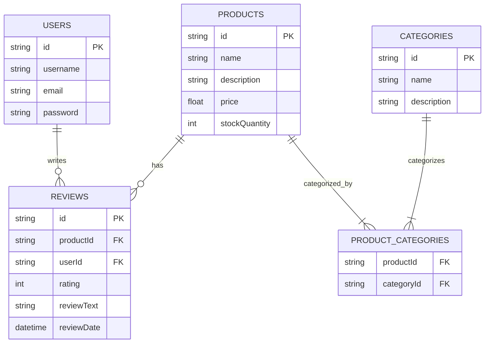

  

# Nozama

Welcome to Nozama!

Nozama is a world-class e-commerce platform that allows users to browse and
purchase products from a wide range of categories. Users can also leave reviews
on products they have purchased, and view reviews left by other users.

This repo contains the source code for the Nozama backend, which is built using
Node.js, Express, and Knex. It is an API which allows the UI team to build any
frontend they like, and connect to the backend using HTTP requests.

## User stories

The following user stories describe the features that Nozama offers to its
users.

**Browsing products:**

- As a shopper, I want to view a list of products so that I can choose what to
  buy.

- As a shopper, I want to view detailed information about a product (including
  its price, description, and reviews) so that I can make an informed purchasing
  decision.

- As a shopper, I want to filter products by categories so that I can narrow
  down my search to a specific type of product.

**Managing accounts:**

- As a new user, I want to create an account with Nozama so that I can track my
  orders and save my preferences.

- As a returning user, I want to log in to my account so that I can access my
  personalised settings.

**Purchasing products:**

- As a shopper, I want to add products to my cart so that I can purchase
  multiple items at once.

- As a shopper, I want to view my cart and adjust the quantity of the products
  before checkout so that I can make last-minute changes to my order.

**Writing and viewing reviews:**

- As a buyer, I want to rate and review a product I've purchased so that I can
  share my experience with other shoppers.

- As a shopper, I want to read reviews and see ratings for a product so that I
  can gauge the product's quality and others' experiences with it.

**Managing inventory:**

- As a Nozama administrator, I want to add new products to the store so that
  shoppers have access to new items.

- As a Nozama administrator, I want to update the stock quantity of products so
  that the website reflects the current inventory.

## Database schema

To understand the database schema, you can use the following Mermaid diagram.

## API endpoints

# Nozama REST API Endpoints Documentation

## User Stories and Associated REST API Endpoints

### 1. Browsing Products

#### View a list of products

- **Endpoint:** `GET /products`
- **Request:** None
- **Response:** Array of products with details (id, name, description, price,
  stockQuantity, imageURL)

#### View detailed information about a product

- **Endpoint:** `GET /products/{productId}`
- **Request:** None
- **Response:** Product details (id, name, description, price, stockQuantity,
  imageURL, reviews)

### 2. Searching and Categorization

#### Search for products by name

- **Endpoint:** `GET /products/search`
- **Request Parameters:** `name` (string)
- **Response:** Array of products matching the search criteria

#### Filter products by categories

- **Endpoint:** `GET /products/category/{categoryId}`
- **Request:** None
- **Response:** Array of products within the specified category

### 3. Managing Accounts

#### Create an account

- **Endpoint:** `POST /users`
- **Request:** User details (username, firstName, lastName, email, password)
- **Response:** Confirmation of account creation

#### Log in to an account

- **Endpoint:** `POST /users/login`
- **Request:** Credentials (username, password)
- **Response:** Authentication token and user details

### 4. Purchasing Products

#### Add products to the cart (Assuming a cart management system)

- **Endpoint:** `POST /cart`
- **Request:** Product ID and quantity
- **Response:** Updated cart details

#### View and adjust the cart

- **Endpoint:** `GET /cart`
- **Request:** None
- **Response:** Cart details including product IDs, quantities, and total price

### 5. Writing and Viewing Reviews

#### Rate and review a product

- **Endpoint:** `POST /reviews`
- **Request:** Review details (productId, userId, rating, reviewText,
  reviewDate)
- **Response:** Confirmation of review submission

#### Read reviews for a product

- **Endpoint:** `GET /products/{productId}/reviews`
- **Request:** None
- **Response:** Array of reviews for the product

### 6. Managing Inventory (Admin)

#### Add new products

- **Endpoint:** `POST /products`
- **Request:** Product details (name, description, price, stockQuantity,
  imageURL)
- **Response:** Confirmation of product addition

#### Update stock quantity

- **Endpoint:** `PUT /products/{productId}/stock`
- **Request:** New stock quantity
- **Response:** Updated product details

### 7. User Administration (Admin)

#### View a list of users

- **Endpoint:** `GET /users`
- **Request:** None
- **Response:** Array of user details

#### Delete user accounts

- **Endpoint:** `DELETE /users/{userId}`
- **Request:** None
- **Response:** Confirmation of account deletion
