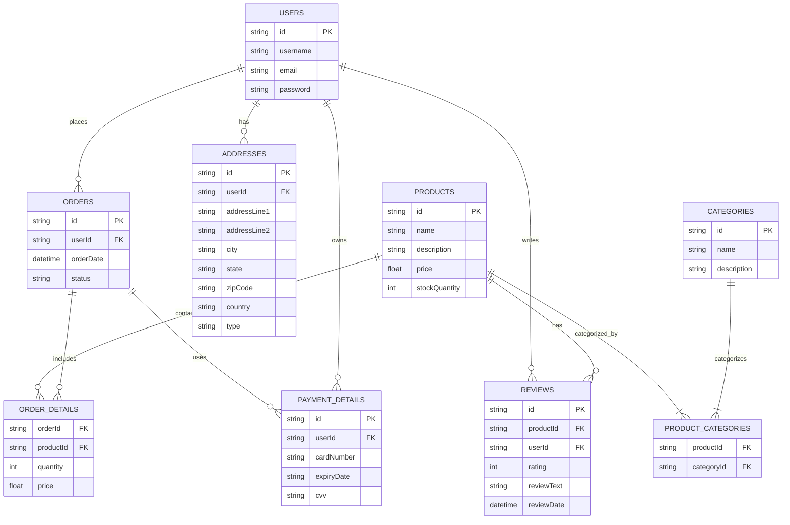

```mermaid
erDiagram
    USERS ||--o{ ORDERS : places
    USERS ||--o{ REVIEWS : writes
    USERS ||--o{ ADDRESSES : has
    PRODUCTS ||--o{ ORDER_DETAILS : contains
    PRODUCTS ||--o{ REVIEWS : has
    PRODUCTS ||--|{ PRODUCT_CATEGORIES : categorized_by
    CATEGORIES ||--|{ PRODUCT_CATEGORIES : categorizes
    ORDERS ||--o{ ORDER_DETAILS : includes
    ORDERS ||--o{ PAYMENT_DETAILS : uses
    USERS ||--o{ PAYMENT_DETAILS : owns

    USERS {
        string id PK
        string username
        string email
        string password
    }

    PRODUCTS {
        string id PK
        string name
        string description
        float price
        int stockQuantity
    }

    CATEGORIES {
        string id PK
        string name
        string description
    }

    PRODUCT_CATEGORIES {
        string productId FK
        string categoryId FK
    }

    ORDERS {
        string id PK
        string userId FK
        datetime orderDate
        string status
    }

    ORDER_DETAILS {
        string orderId FK
        string productId FK
        int quantity
        float price
    }

    REVIEWS {
        string id PK
        string productId FK
        string userId FK
        int rating
        string reviewText
        datetime reviewDate
    }

    ADDRESSES {
        string id PK
        string userId FK
        string addressLine1
        string addressLine2
        string city
        string state
        string zipCode
        string country
        string type
    }

    PAYMENT_DETAILS {
        string id PK
        string userId FK
        string cardNumber
        string expiryDate
        string cvv
    }
```
