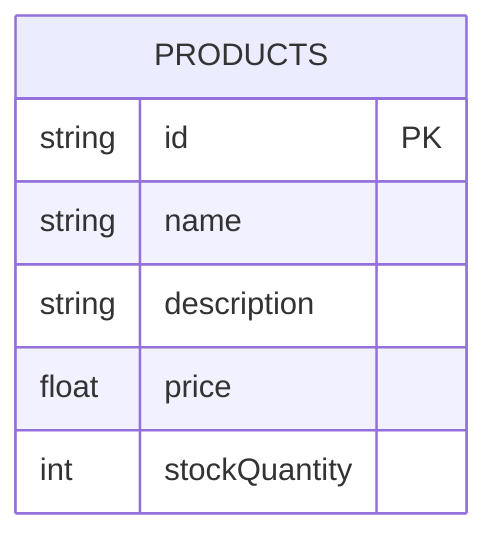
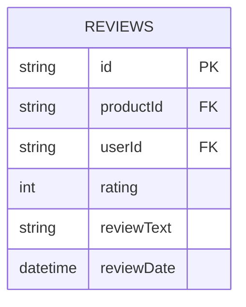

# Day 1

Today's workshop is all about building up the models to add functionality to
Nozama. We are going to add more classes and methods into the `models` directory
so that we are able to query the database for useful results.

Eventually, these models will serve as the backbone of an API, allowing other
developers at Nozama to build websites, mobile apps, and other services that use
the data we have stored in our database.

## Create Product model

1. Create a new file `Product.js` in the `models` folder, and create a new class
   `Product` in it.

2. Add the following static methods to the class:

- `findAll()` - returns an array of all products from the database
- `findById(productId)` - returns a product with the given id
- `create(name, description, price, quantity)` - creates a new product with the
  given data
- `totalStock()` - returns the total number of products in the warehouse (sum of
  the stock quantity)
- `getCategories(productId)` - returns an array of categories for a given
  product

3. Create a file in the `tests` folder called `Product.test.js` and create some
   tests to see whether your methods work as expected. You can use
   `tests/d1e3.test.js` as a reference.

Remember, you can always `npm run db:reset` and `npm run db:seed` to reset the
database to its initial state.

If you would like to practise TDD, you could try writing your tests first.

## Create Reviews model

1. Create a new file `Review.js` in `models` folder, and create a new class
   called `Review`.

2. Add static methods to `Review`:

- `findByProductId` - returns an array of all reviews for a given product
- `getProductAverage` - returns the average rating for a given product
- `findByUserId` - returns an array of all reviews for a given user
- `create` - creates a new review with the given data
- `findTopPicks` - returns an array of top 3 products based on average rating

3. Create a file in the `tests` folder called `Review.test.js` and create some
   tests to ensure your methods work as expected.
